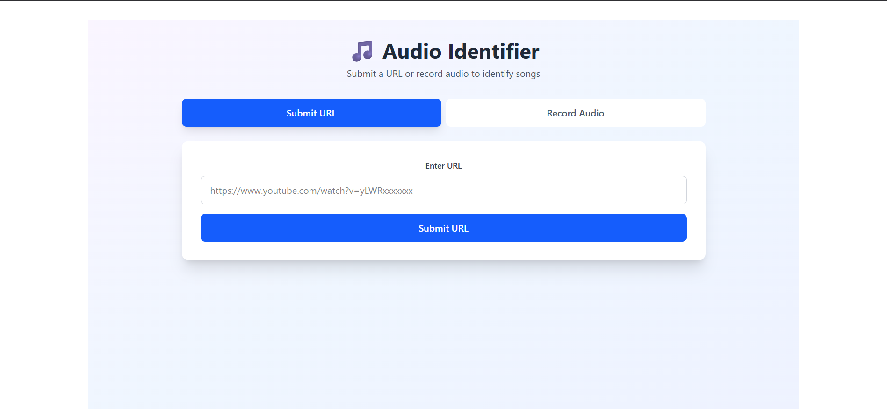

# Shazam-like Audio Fingerprinting System

A full-stack audio fingerprinting application that identifies songs using advanced signal processing and machine learning. This project implements the Shazam algorithm to create unique audio fingerprints and match them against a database of known songs.

## 📸 Screenshots & Demo

Add your application screenshots and demo images here:

| Feature | Image |
|---------|-------|
| Audio Upload Interface |  |
| Fingerprint Visualization |  |
| Song Match Results |  |
| API Documentation |  |

> **Note**: Add screenshot images to `docs/images/` folder in the project root

## 🎵 Features

- **Audio Fingerprinting**: Generate unique audio fingerprints using spectral analysis and peak detection
- **Song Identification**: Match audio samples against a database of fingerprints
- **YouTube Integration**: Download and process audio directly from YouTube URLs
- **Real-time Processing**: Stream audio processing with chunked data handling
- **Interactive Web Interface**: User-friendly React frontend for audio recording and uploads
- **Database Storage**: Supabase cloud database for storing fingerprints and metadata
- **RESTful API**: FastAPI-based backend with CORS support

## 🏗️ Project Structure

```
shazam/
├── backend/                          # FastAPI backend server
│   ├── main.py                      # FastAPI application entry point
│   ├── audio/
│   │   ├── AudioProcessing.py       # Core audio fingerprinting algorithm
│   │   └── testing.py               # Audio processing tests
│   ├── route/
│   │   └── route.py                 # API route handlers
│   ├── db/
│   │   └── db.py                    # Database client initialization
│   ├── model/
│   │   └── audio.py                 # Data models
│   └── chunks/                      # Temporary chunk storage
├── frontend/                         # React + Vite frontend
│   ├── src/
│   │   ├── App.jsx                  # Main application component
│   │   ├── pages/
│   │   │   └── audioRecord.jsx      # Audio recording interface
│   │   └── assets/                  # Static assets
│   └── package.json                 # Frontend dependencies
├── docker-compose.yml               # PostgreSQL database configuration
└── requirements.txt                 # Python dependencies
```

## 🔧 Tech Stack

### Backend
- **FastAPI**: Modern Python web framework for building APIs
- **LibROSA**: Audio analysis library
- **SciPy**: Signal processing
- **OpenCV**: Image/audio processing utilities
- **Pydub**: Audio file conversion
- **yt-dlp**: YouTube audio downloading
- **SQLAlchemy**: ORM for database operations
- **Supabase/PostgreSQL**: Database for storing fingerprints

### Frontend
- **React 19**: UI library
- **Vite**: Build tool and dev server
- **Tailwind CSS**: Styling framework
- **React Hot Toast**: Notifications

## 📋 Prerequisites

**Option 1: Docker (Recommended - Easiest)**
- Docker Desktop
- Docker Compose
- Supabase account with API credentials

**Option 2: Manual Setup**
- Python 3.8+
- Node.js 16+
- FFmpeg (for audio processing)
- Supabase account with API credentials

## 🚀 Installation

### 1. Clone the Repository
```bash
git clone <repository-url>
cd shazam
```

### Option A: Using Docker (Recommended) 🐳

The easiest way to run the entire application with automatic dependency installation:

**Step 1**: Create a `.env` file 

**Step 2**: Update the `.env` file with your Supabase credentials
```env
SUPABASE_URL=<your-supabase-url>
SUPABASE_KEY=<your-supabase-key>
```

**Step 3**: Start all services with a single command
```bash
docker-compose up --build
```

This will:
- ✅ Build and start FastAPI backend (with all Python dependencies)
- ✅ Build and start React frontend (with all Node dependencies)
- ✅ Automatically install all required packages
- ✅ Set up networking between services
- ✅ Connect to Supabase (no local database needed)

**Access the application:**
- Frontend: `http://localhost:5173`
- Backend API: `http://localhost:8000`
- API Docs: `http://localhost:8000/docs`

**Stop all services:**
```bash
docker-compose down
```

**View logs:**
```bash
docker-compose logs -f backend    # Backend logs
docker-compose logs -f frontend   # Frontend logs
```

---

### Option B: Manual Setup (without Docker)

#### 2. Backend Setup

Navigate to the backend directory and install Python dependencies:

```bash
cd backend
pip install -r ../requirements.txt
```

Create a `.env` file with your Supabase credentials:
```env
SUPABASE_URL=<your-supabase-url>
SUPABASE_KEY=<your-supabase-key>
```

#### 3. Frontend Setup

Navigate to the frontend directory and install Node dependencies:

```bash
cd frontend
npm install
```

#### 4. Running the Application (Manual)

In one terminal, start the backend:
```bash
cd backend
python main.py
```

The backend will run on `http://localhost:8000`

In another terminal, start the frontend:
```bash
cd frontend
npm run dev
```

The frontend will run on `http://localhost:5173`

---

## 📚 Docker Deployment Details

### Docker Services Architecture

```
┌─────────────────────────────────────┐
│     Docker Compose Network          │
├─────────────────────────────────────┤
│  Frontend (Node.js)                 │
│  - Port: 5173                       │
│  - Auto-installs dependencies       │
│  - Hot reload enabled               │
├─────────────────────────────────────┤
│  Backend (Python/FastAPI)           │
│  - Port: 8000                       │
│  - Auto-installs dependencies       │
│  - FFmpeg pre-installed             │
├─────────────────────────────────────┤
│  Supabase (Cloud Database)          │
│  - Remote PostgreSQL instance       │
│  - No local setup needed            │
└─────────────────────────────────────┘
```

### Docker Commands Reference

```bash
# Start all services
docker-compose up --build

# Start in background
docker-compose up -d --build

# Stop all services
docker-compose down

# View logs
docker-compose logs -f

# Rebuild a specific service
docker-compose up --build backend

# Execute command in running container
docker-compose exec backend bash
docker-compose exec frontend bash
docker-compose exec db psql -U postgres
```

---

## 📡 API Endpoints

### Health Check
- `GET /` - Server status

### Audio Upload & Processing
- `POST /audio_upload` - Upload audio from YouTube URL or file
  - Request body: `{"url": "youtube_url"}`
  
### Audio Fingerprinting
- Process uploaded audio and generate fingerprints
- Store fingerprints in database
- Match against existing fingerprints

## 🎤 How It Works

### 1. Audio Fingerprinting Algorithm

The fingerprinting process consists of several steps:

**Spectral Analysis**:
- Convert audio to frequency domain using FFT
- Generate spectrogram with normalized values
- Normalize using standard deviation and mean

**Peak Detection**:
- Identify local maxima in the spectrogram
- Filter peaks based on loudness threshold
- Create constellation map of peaks

**Hashing**:
- Generate anchor points from peak pairs
- Create hashes from frequency pairs and time deltas
- Encode hashes for efficient database storage

**Matching**:
- Compare input fingerprint against database
- Count hash matches to identify songs

### 2. Audio Processing Pipeline

1. **File Conversion**: Convert audio to standard WAV format
2. **Streaming**: Process audio in chunks for memory efficiency
3. **FFmpeg Integration**: Stream YouTube audio at specified sample rate
4. **Normalization**: Normalize audio levels for consistent fingerprinting

## 🔑 Key Components

### AudioProcessing Class
Handles all audio processing and fingerprinting:
- `converting_to_frequency_domain()` - FFT and spectrogram generation
- `constellation_map()` - Peak detection
- `fingerPrinting()` - Anchor point generation
- `hashing()` - Hash encoding
- `encode_hash()` - Bit-packing for efficient storage

### API Routes
- Audio upload and processing
- YouTube integration with streaming
- Database operations
- Fingerprint matching

## 📊 Configuration

Key parameters in `route.py`:
```python
SAMPLE_RATE = 44100        # Hz
SAMPLE_WIDTH = 2           # Bytes
CHANNELS = 1               # Mono
CHUNK_DURATION_SEC = 5     # Seconds per chunk
BATCH = 1000               # Database batch size
```

## 🐛 Troubleshooting

### FFmpeg Not Found
Install FFmpeg:
- **Windows**: `choco install ffmpeg`
- **macOS**: `brew install ffmpeg`
- **Linux**: `apt-get install ffmpeg`

### Database Connection Error
Ensure PostgreSQL is running:
```bash
docker-compose ps
```

### CORS Issues
Update `allow_origins` in `backend/main.py` with your frontend URL

## 📝 Development

### Running Tests
```bash
cd backend
python audio/testing.py
```

### Building Frontend
```bash
cd frontend
npm run build
```

### Linting
```bash
cd frontend
npm run lint
```

## 🔐 Security Notes

- Update default PostgreSQL password in `docker-compose.yml`
- Restrict CORS origins in production
- Validate API inputs
- Use environment variables for sensitive data

## 📄 License

This project is open source and available under the MIT License.

## 🤝 Contributing

Contributions are welcome! Please feel free to submit pull requests or open issues for bugs and feature requests.

## 📚 References

- [Shazam's Algorithm](https://en.wikipedia.org/wiki/Shazam_(service))
- [Audio Fingerprinting](https://en.wikipedia.org/wiki/Audio_fingerprint)
- [FastAPI Documentation](https://fastapi.tiangolo.com/)
- [React Documentation](https://react.dev/)
- [LibROSA Documentation](https://librosa.org/)
